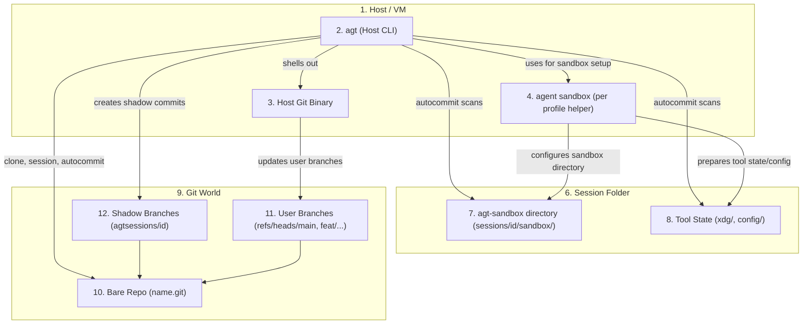
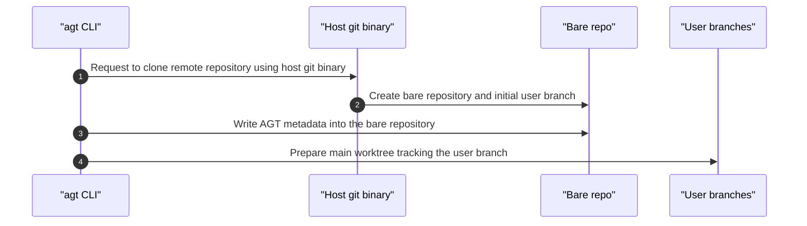
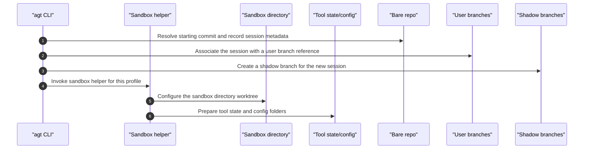
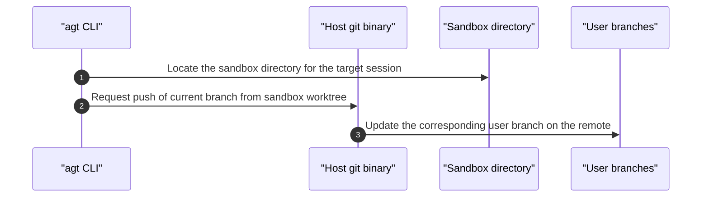
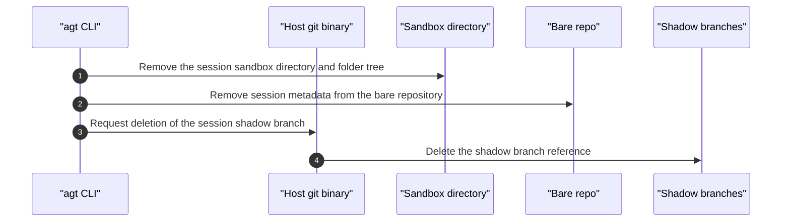
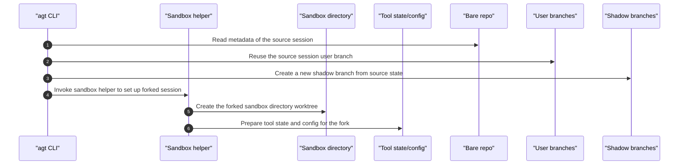
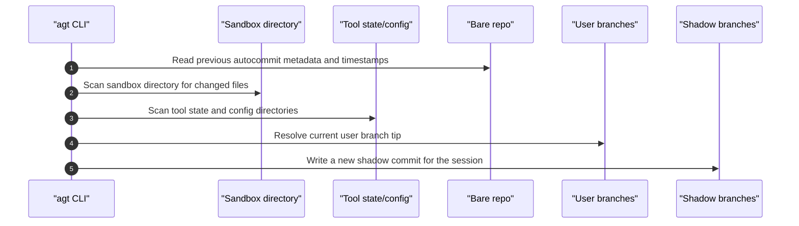
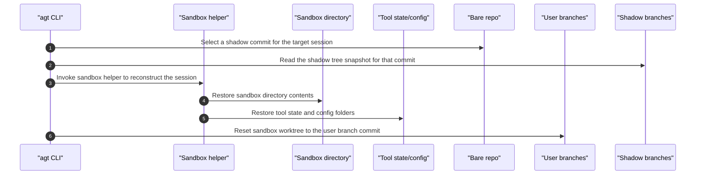
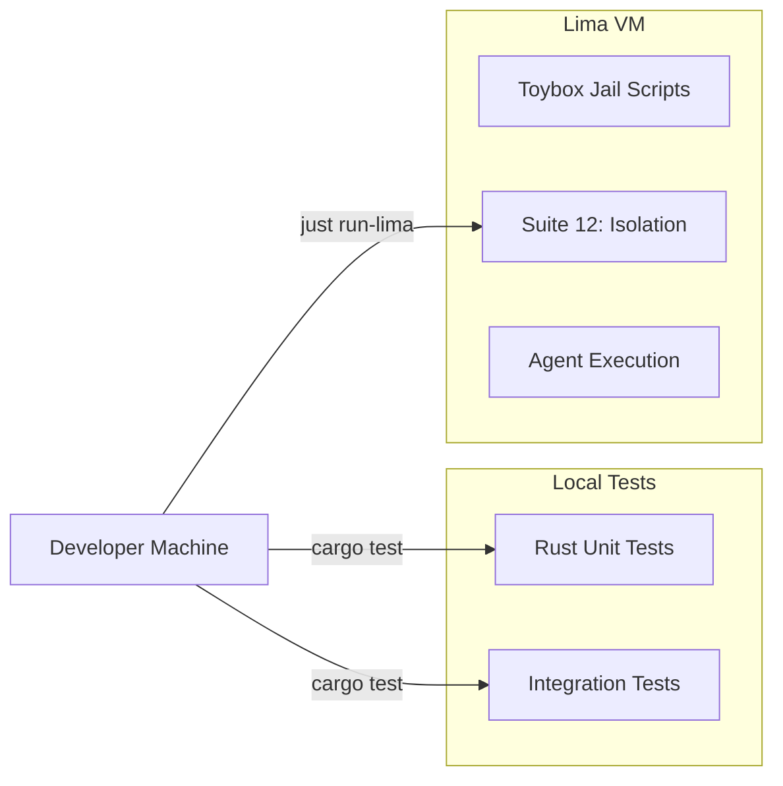

# AGT Architecture Design (2026-01-04)

This document captures the target architectural state of AGT as of January 4, 2026.

## Terminology

| Term | World | Meaning |
|------|-------|---------|
| **Session** | Disk | An agent run with a unique ID, folder on disk, conversation history |
| **Session folder** | Disk | The folder on disk where the session lives (`sessions/<id>/`) |
| **Sandbox** | Disk | The folder where the agent runs, jailed into which is a git worktree checkout (`sessions/<id>/sandbox/`) |
| **Shadow branch** | Git | The branch where autocommits are stored (`agtsessions/<id>`) |
| **User branch** | Git | The branch standard commits of the user codebase are made |
| **Shadow commit** | Git | An autocommit on the shadow branch with two parents discussed below |
| **Shadow tree** | Git | The tree object in a shadow commit |
| **Shadow root** | Git | The root of the shadow tree (which is the session folder) |
| **Profile** | Config | Tool-specific folder requirements (opencode, cursor, claude-code, etc.) |

Commits made by the tooling/agent in the sandbox folder `sessions/<id>/sandbox/` are logically at the root of the repo and only see files inside the jail. These are committed to standard user branches. Only these clean branches may be exported back to remote repos. 

Commits made using autocommit have a logical file system that is one level higher than user commits `sessions/<id>/` and include files in the sandbox subfolder by design. No `.gitignore`, no `git add`, and no `git index` is used with autocommit. Everything is added and committed to the shadow branch when the file modification time is greater than the last commit time. The shadow commit tree overlaps with the user branch commit tree, which is required to snapshot files marked `.gitignore`. The git index file of what the agent has added/removed from its worktree check is also backed up into the shadow commit as a file `_/index`. 

The design is intended to enable full-time travel when the agent is configured to log its session state to a jailed-mounted file in the `sessions/<id>/` folder. Any or all of the `sessions/<id>/` can be deleted to save space. Yet a command can be run to recreate the `sessions/<id>/` as at a specific shadow commit. This will restore: 

1. The `sessions/<id>/` folder that will have folders for the agent config, agent state, and any original setup details. 
2. The `sessions/<id>/sandbox` folder will be restored twice; once for the autocommit that puts back `.gitignore` folders and once for the worktree checkout.
3. The git index backed up at `_/index` will be restored to the worktree checkout.
4. The jail will be reapplied to the `sessions/<id>/sandbox`.
5. As long as the agent config and jail had the agent messages and session state mapped into `sessions/<id>/`, the agent's complete state will have been restored. 

This means you get a complete automatic restoration of agent state and disk state, and even restores the `git add`/`git rm` work, as well as all the interim build files marked as `.gitignore`. 

If an agent supports a "fork" so that you can have two sessions with divergent histories, you will be able to run forks in parallel in different sandboxes. For example

1. Fork the agent session to get a new id. 
2. Clone the whole session folder. 
3. Rest the original agent and fork it again to get another new id.
4. Run both agents in parallel with an alternative prompt+model combination.
5. Repeat the above several times to have racing models work on alternative solution designs. 


## CLI Commands

| Command | Purpose |
|---------|---------|
| `agt clone <url>` | Clone remote repo, create bare repo with main worktree |
| `agt session new [--id <id>]` | Create new session for a fresh ticket |
| `agt session autocommit` | Create shadow commit capturing session state |
| `agt session export` | Push user branch to remote (e.g. `origin`) |
| `agt session remove <id>` | Remove a session and its shadow branch |
| `agt session restore` | Checkout the `sessions/<id>/` to a prior shadow state |
| `agt session fork <from-id>` | Fork existing session (advanced, for parallel work)  |


Shadow branches (`agtsessions/*`) are **never** pushed to origin. Only user branches are exported.

## 1. High-Level Concept

AGT (Agent Git Tool) provides a time-travelling, immutable filesystem for AI agents. Agents work in parallel on the same codebase without interfering with each other or the user, while everything is **everything** (code, config, runtime state, session messages) in the git graph. 

Key design points:
- **Infrastructure**: Primary target is Linux (VM or VPS) with chroot jails.
- **Isolation**: Agents are jailed in their sandbox folder.
- **State Capture**: Autocommit captures the entire session folder as the shadow tree.
- **Profiles**: Different tools (opencode, cursor, etc.) have different folder requirements; profiles define what gets mounted into the jail.

The idea of a profile is to ensure that the correct agent config and agent state folders are mounted into the sandbox jail. The key ingredient of the solution is that the git object store deduplicates files on disk. It uses efficient compressed data structures that represent files and folders. AGT uses git as an immutable file storage solution to snapshot the complete disk state and configuration of agents. 

## 2. Session Layout

A session is a folder on disk. The shadow tree mirrors this folder exactly.

### Disk Layout (Session Folder)

The following sketches a possible layout for opencode

```
sessions/<id>/                    # Session folder
└── _/                            # AGT system folder
    └── index                     # Git index blob (captured state)
├── sandbox/                      # Agent runs here (jailed)
│   ├── src/
│   ├── Cargo.toml
│   └── .git                      # Points to bare repo
├── xdg/                          # XDG_DATA_HOME (agent "~" state)
│   └── opencode/
│       └── storage/
├── config/                       # XDG_CONFIG_HOME (tool config)
│   └── opencode/
│       └── opencode.json
```

The aim is to ensure that the agent tool (i.e. `opencode`) has its config and state all within the `sessions/<id>/` so that the autocommit snapshots everything. The `_/index` file snapshots what has been added but not committed in the `sandbox` worktree. 

### Git Layout (Shadow Tree)

The shadow tree is just the session folder as a git tree:

```
(shadow root)                     # = sessions/<id>/ on disk
├── sandbox/
│   ├── src/
│   └── Cargo.toml
├── xdg/
│   └── opencode/...
├── config/
│   └── opencode/...
└── _/
    └── index                     # Git index at time of autocommit
```

Different agentic tools (e.g. Mistral Vibe, OpenCode, Gemini Cli) require different folders. The profile defines which state and config folders exist within the session folder and how they are mounted into the jail. Autocommit automatically captures everything in the session folder. Alternative profiles may be created to set up the sandbox to work with any agentic tools. 

## 3. Shadow Branch Topology

User branches (`main`, `develop`, `feat/xyz`) remain **completely clean**. Standard git operations work normally inside the sandbox against the user branch. The shadow commit backsup the git index of the working tree. If an agent tool is set to "autocommit, there will be matching commits between the two branches. If the agent is not set to autocommit, then shadow commits will include a complete backup, including `git add`/`git rm` operations that have not yet been committed. 

It is expected that autocommit be called whenever the agent returns control to the user. This can be simulated by calling autocommit when new input is sent from the user. The exact mechanism used to invoke autocommit will be agent-specific. 

Shadow commits capture the complete agentic session state.

TODO DIAGRAM

**Key Points**:
1. **No merge** - Shadow commits reference the user branch as parent2, but there is no merge of the tree. 
2. **Two parents** - Every shadow commit has: parent1 = previous shadow commit, parent2 = user branch tip.
3. **Git Index backup** - Every shadow commit exports the sandbox git index file to back it up in a `_` folder in the shadow commit. 
4. **Different tree roots**:
   - User branch tree: rooted at sandbox contents (the code)
   - Shadow tree: rooted at session folder (config + _/ + sandbox + xdg + ...)

The exact set of folders in the session folder depends on the agent tool being used. The autocommit feature backs up all the disk state regardless of what is on disk. 

The autocommit does not use a `.gitignore` file and does not require `git add`; instead, it uses file creation and modification times to find all new and modified files. To find deleted files, it scans the shadow branch tree and compares it to the files on disk to detect files that were moved or removed. 

## 4. Snapshot Restore Process

To restore session state at shadow commit `[SC2]`:

1. The sandbox jail is recreated.
2. Inside sandbox, checkout user branch (parent2 of `[SC2]`).
3. At the top-level checkout, the session branch (parent1 of `[SC2]`).
4. Restore `_/index` as the git index.
5. Agent state and config have been reset to the last autocommit.
6. Agent sees: clean user code + captured environment + index state.

Note that by design, the shadow commit will back up things like `node_modules` within the sandbox folder that were in the `.gitignore` of the user branch. When the shadow branch is checked out, these files are restored. 

Note that the profile that jail mounts the agent config, message files and session state should be set up to ensure that the shadow commit puts the agent into the exact historic state.  

## 5. Export Process

The user branches remain clean. There is no merge action between the user branches and the shadow commits. All that is happening is that the shadow commits are "linked" to an extra parent which points to what is in the agent's git worktree. That one extra link is simply a logical pointer to a commit on another branch. The sandbox can be set up to use `agt` as the `git` process. It will then filter out the shadow branches, hiding them from the agent. This ensures that exporting a user branch never includes the shadow commits that provide a complete snapshot of the disk and the agent state. 

Logically, the export process is simply a git push of the user branch. It is referred to as an export as it detaches the user commits from the session snapshot commits. It is possible to leave a standard `git` in the sandbox to push to the remote origin. The author prefers to allow agents only to `git add`/`git mv`/`git restore`/`git commit`, and to use an agt-based workflow to manage branches and merges. 

## 6. Profiles

A profile defines what folders a tool needs in its jail. Examples:

| Tool | Folders Required |
|------|------------------|
| opencode | `xdg/`, `config/` |
| vibe | TBD |
| gemini-cli | TBD |

When `agt session new` creates a session, it creates folders based on the profile. This will involve invoking an `agt-sandbox` script to set up the correct chroot jail commands. Those is on a per-agent basis to be bind-mounted to the locations the tool expects (e.g., `~/.local/share/`, `~/.config/`).

Autocommit doesn't care about profiles - it just captures everything in the session folder.

## 7. Component Architecture



## 8. Key Flows

The sequence diagrams in this section use descriptive participant names that
match the components from the component diagram above. `autonumber` is enabled
so each message is numbered automatically.

### `agt clone <url>`



Resulting layout (conceptual):

```
repo/
├── repo.git/           # Bare repository (git object store)
├── .git                # Text file pointing to repo.git
├── main/               # Primary worktree (main branch)
└── sessions/           # Session folders live here
```

### `agt session new [--id <id>]`



### `agt session export`



Shadow branches are not exported; only user branches are pushed.

### `agt session remove <id>`



### `agt session fork <from-id> [--id <new-id>]`



### `agt autocommit`



### Recovery (future `agt session restore`)



## 9. Testing Infrastructure



- **Working VM**: `agt_agent_sandbox` (can be reset)
- **Backup VM**: `agt_sandbox_backup` (never delete)
- **Toybox**: Submodule providing chroot jail tools
