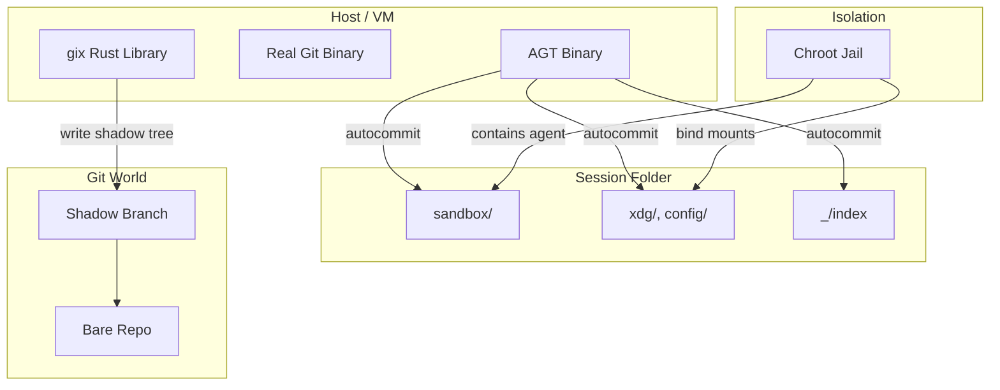

# AGT Architecture Design (2026-01-04)

This document captures the target architectural state of AGT as of January 4, 2026.

## Terminology

| Term | World | Meaning |
|------|-------|---------|
| **Session** | Disk | An agent run with a unique ID, folder on disk, conversation history |
| **Session folder** | Disk | The folder on disk where the session lives (`sessions/<id>/`) |
| **Sandbox** | Disk | The folder where the agent runs, jailed into which is a git worktree checkout (`sessions/<id>/sandbox/`) |
| **Shadow branch** | Git | The branch where autocommits are stored (`agtsessions/<id>`) |
| **User branch** | Git | The branch standard commits of the user codebase are made |
| **Shadow commit** | Git | An autocommit on the shadow branch with two parents discussed below |
| **Shadow tree** | Git | The tree object in a shadow commit |
| **Shadow root** | Git | The root of the shadow tree (which is the session folder) |
| **Profile** | Config | Tool-specific folder requirements (opencode, cursor, claude-code, etc.) |

Commits made by the tooling/agent in the sandbox folder `sessions/<id>/sandbox/` are logically at the root of the repo and only see files inside the jail. These are committed to standard user branches. Only these branches may be exported back to remote repos. 

Commits made using autocommit have a logical file system that is one level higher than user commits `sessions/<id>/` and overlap. There is no `.gitignore`, no `git add` and no `git index`. Everything is automatically added and committed to the shadow branch based on file modification time. The tree overlaps with the user commits, which are required to snapshot files that are marked `.gitignore`. The git index file of what the agent has added is also added into the shadow commit as a file `_/index`. 

The design is intended to allow full-time travel when the agent is configured to log its actions to a jailed-mounted file location in the `sessions/<id>/` folder. Any or all of the `sessions/<id>/` can be deleted to save space. Yet a command can be run to recreate the `sessions/<id>/` as at a specific shadow commit. This will restore 

## CLI Commands

| Command | Purpose |
|---------|---------|
| `agt clone <url>` | Clone remote repo, create bare repo with main worktree |
| `agt session new [--id <id>]` | Create new session for a fresh ticket |
| `agt session autocommit` | Create shadow commit capturing session state |
| `agt session export` | Push user branch to remote (e.g. `origin`) |
| `agt session remove <id>` | Remove a session and its shadow branch |
| `agt session restore` | Checkout the `sessions/<id>/` to a prior shadow state |
| `agt session fork <from-id>` | Fork existing session (advanced, for parallel work)  |


Shadow branches (`agtsessions/*`) are **never** pushed to origin. Only user branches are exported.

## 1. High-Level Concept

AGT (Agent Git Tool) provides a time-travelling, immutable filesystem for AI agents. Agents work in parallel on the same codebase without interfering with each other or the user, while everything is **everything** (code, config, runtime state, session messages) in the git graph. 

Key design points:
- **Infrastructure**: Primary target is Linux (VM or VPS) with chroot jails.
- **Isolation**: Agents are jailed in their sandbox folder.
- **State Capture**: Autocommit captures the entire session folder as the shadow tree.
- **Profiles**: Different tools (opencode, cursor, etc.) have different folder requirements; profiles define what gets mounted into the jail.

The idea of a profile is to ensure that the correct agent config and agent state folders are mounted into the sandbox jail. 

## 2. Session Layout

A session is a folder on disk. The shadow tree mirrors this folder exactly.

### Disk Layout (Session Folder)

The following sketches a possible layout for opencode

```
sessions/<id>/                    # Session folder
└── _/                            # AGT system folder
    └── index                     # Git index blob (captured state)
├── sandbox/                      # Agent runs here (jailed)
│   ├── src/
│   ├── Cargo.toml
│   └── .git                      # Points to bare repo
├── xdg/                          # XDG_DATA_HOME (agent "~" state)
│   └── opencode/
│       └── storage/
├── config/                       # XDG_CONFIG_HOME (tool config)
│   └── opencode/
│       └── opencode.json
```

The aim is to ensure that the 

### Git Layout (Shadow Tree)

The shadow tree is just the session folder as a git tree:

```
(shadow root)                     # = sessions/<id>/ on disk
├── sandbox/
│   ├── src/
│   └── Cargo.toml
├── xdg/
│   └── opencode/...
├── config/
│   └── opencode/...
└── _/
    └── index                     # Git index at time of autocommit
```

Different tools require different folders. The profile defines which folders exist in the session folder. Autocommit captures everything in the session folder automatically.

## 3. Shadow Branch Topology

User branches (`main`, `develop`, `feat/xyz`) remain **completely clean**. Standard git operations work normally inside the sandbox against the user branch.

Shadow commits capture the full session state.

```
User Branch (clean)                Shadow Branch (session snapshots)
==================                 =================================

  main                              agtsessions/agent-001
    │                                        │
    ▼                                        │
  [A]─────────────────────────────────►[Fork]◄── parent2 = main HEAD
    │                                        │
    ▼                                        ▼
  [B] ← user commits normally         [SC1]◄─┬── parent1 = Fork
    │   (git add/commit in sandbox)          └── parent2 = main HEAD
    │                                        │
    ▼                                        ▼
  [C]                                  [SC2]◄─┬── parent1 = SC1
    │                                        └── parent2 = main HEAD
    ▼
  [D] ← user can keep working          ... shadow commits continue
```

**Key Points**:
1. **No merge** - Shadow commits reference the user branch as parent2, but don't merge into it.
2. **Two parents** - Every shadow commit has: parent1 = previous shadow commit, parent2 = user branch tip.
3. **Different tree roots**:
   - User branch tree: rooted at sandbox contents (the code)
   - Shadow tree: rooted at session folder (sandbox + xdg + config + _/)

**Recovery Process**:
To restore session state at shadow commit `[SC2]`:
1. Checkout shadow tree to session folder.
2. Inside sandbox, checkout user branch (parent2 of `[SC2]`).
3. Restore `_/index` as the git index.
4. Agent sees: clean user code + captured environment + index state.

## 4. Profiles

A profile defines what folders a tool needs in its jail. Examples:

| Tool | Folders Required |
|------|------------------|
| opencode | `xdg/`, `config/` |
| cursor | TBD |
| claude-code | TBD |

When `agt session new` creates a session, it creates folders based on the profile. When the chroot jail is constructed, these folders are bind-mounted to the locations the tool expects (e.g., `~/.local/share/`, `~/.config/`).

Autocommit doesn't care about profiles - it just captures everything in the session folder.

## 5. Component Architecture



## 6. Key Flows

### `agt clone <url>`
1. Parse git URL to extract org/repo.
2. Create directory structure: `org/repo/`.
3. Clone as bare repo into `.bare/`.
4. Write `.git` file pointing to `.bare`.
5. Create main worktree: `main/`.
6. Initialize AGT metadata in `.bare/agt/`.

Result:
```
org/repo/
├── .bare/              # Bare repository (git database)
├── .git                # Text file pointing to .bare
├── main/               # Primary worktree (main branch)
└── sessions/           # Session folders live here
```

### `agt session new [--id <id>]`
1. Generate session ID (or use provided `--id`).
2. Resolve starting point (`HEAD` or `--from`).
3. Create shadow branch `agtsessions/<id>`.
4. Create session folder structure based on profile.
5. Create sandbox (implementation detail: git worktree).
6. Record session metadata.

### `agt session export`
1. Check for uncommitted changes in sandbox (fail if dirty).
2. Get current branch in sandbox.
3. Push branch to origin.
4. Report success/failure.

Note: Shadow branches are **never** exported to origin.

### `agt session remove <id>`
1. Remove session folder (`sessions/<id>/`).
2. Remove git worktree.
3. Delete shadow branch (`agtsessions/<id>`).
4. Clean up session metadata.

### `agt session fork <from-id> [--id <new-id>]`
Advanced command for tools that support parallel sessions (e.g., opencode).
1. Find existing session `<from-id>`.
2. Create new session based on current state of `<from-id>`.
3. New session gets its own shadow branch.

### `agt autocommit`
1. Scan session folder for changes (mtime > last_scan).
2. Build shadow tree from session folder contents.
3. Include `_/index` with current git index state.
4. Create shadow commit with 2 parents:
   - Parent 1: Previous shadow commit
   - Parent 2: Current user branch tip
5. Update timestamp.

### Recovery (future `agt session restore`)
1. Checkout shadow tree to session folder.
2. Restore `_/index` as git index in sandbox.
3. Reset sandbox to user branch (parent2).
4. Agent resumes with full state.

## 7. Testing Infrastructure


- **Working VM**: `agt_agent_sandbox` (can be reset)
- **Backup VM**: `agt_sandbox_backup` (never delete)
- **Toybox**: Submodule providing chroot jail tools

## 8. Current Status

- **CLI restructure**: In progress - migrating to `agt clone` + `agt session {new,export,remove,fork}`
- **Terminology migration**: Complete (shadow = git world, session/sandbox = disk world)
- **Tests**: Pass after terminology migration
- **Build**: Green

## 9. Next Steps

1. Complete CLI restructure (docs → tests → code)
2. Implement `agt clone` (replace `agt init`)
3. Implement `agt session new` (replace `agt fork`)
4. Implement `agt session export` (new)
5. Rename `agt prune-session` → `agt session remove`
6. Implement `_/index` capture in autocommit
7. Implement profiles for opencode
8. Migrate Suite 12 to Lima VM
