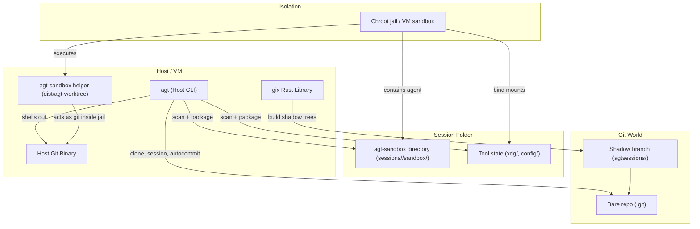

# AGT Monorepo

A polyglot monorepo for AI agent tooling, using [mise](https://mise.jdx.dev/) for tool version management.

## Overview

This repository contains tools for managing AI agent coding sessions with immutable filesystem snapshots and time-travel capabilities. The primary tool is `agt` (Agent Git Tool), a Git wrapper that enables:

- **Parallel agent workflows** - Multiple AI agents work concurrently in isolated worktrees
- **Immutable history** - Every file modification is captured in the Git object store
- **Sandboxing Infrastructure** - Support for robust isolation via chroot jails (using [toybox](https://github.com/landley/toybox)) and VM/VPS environments
- **Time travel** - Roll back to any point in agent history, fork from any state
- **Transparent user experience** - When invoked as `git`, agent branches are hidden

## Infrastructure & Sandboxing

AGT is designed for "power developers" who need robust isolation. While it can run locally on macOS/Linux, the recommended production setup leverages **Linux VMs or VPS** environments for complete isolation ("YOLO mode").

We include a custom fork of [toybox](https://github.com/simbo1905/toybox) (branch `agt-agent-sandbox`) as a submodule to facilitate creating chroot jails. This ensures agents can run untrusted code safely without compromising the host system.

**Deployment Models:**
1. **Local Linux VM** (Recommended for development): Use [Lima](https://github.com/lima-vm/lima) or similar to run AGT in a disposable Ubuntu VM.
2. **VPS** (Recommended for production): Deploy to a cheap Linux VPS for full isolation.
3. **Local Host** (Supported): Run directly on macOS/Linux for trusted workflows (no jail).

## Repository Structure

```
agt/
├── README.md           # This file
├── AGENTS.md           # Guidance for AI coding agents
├── mise.toml           # Tool version management
├── docs/
│   └── agt.1.txt       # Man page for agt tool
├── vendor/
│   └── toybox/         # toybox submodule for chroot jails
├── crates/
│   ├── agt/            # Rust implementation of agt
│   │   ├── Cargo.toml
│   │   └── src/
│   └── agt-worktree/   # Sandbox helper binary
└── CODING_PROMPT.md    # Implementation prompt for AI agents
```

## Tools

### agt - Agent Git Tool

A dual-mode Git wrapper that spawns the host git binary and filters its output:

- **As `git`**: Spawns the host git, filters stdout to hide shadow branches/commits
- **As `agt`**: Full visibility plus session management commands

Key commands:
- `agt clone <url>` - Clone remote repo into agt-managed structure
- `agt session new [--id <id>]` - Create new agent session
- `agt session export` - Push user branch to remote origin
- `agt session remove --id <id>` - Remove a session
- `agt autocommit --session-id <id>` - Snapshot session state

See [docs/agt.1.txt](docs/agt.1.txt) for the complete man page.

## Configuration

AGT uses its own configuration files, separate from git's:

- `~/.agtconfig` - Global configuration
- `.agt/config` - Local repository configuration

Example `~/.agtconfig`:
```ini
[agt]
    gitPath = /opt/git/bin/git
    agentEmail = agt.opencode@local
    branchPrefix = agtsessions/
```

**Required settings:**
- `agt.gitPath` - Path to the host git binary (should NOT be on PATH)
- `agt.agentEmail` - Email for agent commits (filtered in git mode)
- `agt.branchPrefix` - Prefix for agent branches (default: `agtsessions/`)

## Quick Start

```bash
# Install mise if not present
curl https://mise.run | sh

# Clone and setup
git clone <this-repo>
cd agt
mise install

# Build
make build

# Configure agt (in ~/.agtconfig)
cat >> ~/.agtconfig << 'EOF'
[agt]
    gitPath = /usr/bin/git
    agentEmail = agt.opencode@local
    branchPrefix = agtsessions/
EOF

# Clone a project with agt
dist/agt clone https://github.com/user/project.git
cd project/main

# Create an agent session
agt session new --id agent-001

# After agent work, autocommit (captures entire session folder)
agt autocommit -C sessions/agent-001 --session-id agent-001

# Export user branch to remote
agt session export --session-id agent-001
```

## Development

This is a polyglot monorepo managed with mise. Currently includes:

- **Rust** - Core `agt` tool (crates/agt) and sandbox helper (crates/agt-worktree)

### Prerequisites

- [mise](https://mise.jdx.dev/) for tool management
- Rust toolchain (managed via mise)

### Building

```bash
mise install          # Install all tools
make build            # Build all binaries to dist/
```

After building, binaries are in `dist/`:
- `dist/agt` - Host-side AGT CLI
- `dist/agt-worktree` - Sandbox helper used inside agent sessions

Run AGT from the `dist/` folder or add it to your PATH:

```bash
export PATH="/path/to/agt/dist:$PATH"
```

The `agt` and `agt-worktree` binaries should be in the same folder. `agt` runs on the host, while `agt-worktree` is copied into the sandbox and invoked as the in-jail git shim.

## Component Diagram



### Diagram Notes

- `agt (Host CLI)` is the binary you run on the host. It parses commands like `session new` and `autocommit`, drives Git operations via `gix`, and shells out to the **Host Git Binary** when necessary.
- `agt-sandbox helper (dist/agt-worktree)` is the helper binary provided to the jailed agent. Inside the sandbox it behaves like `git`, delegating to the Host Git Binary for actual Git commands.
- The **agt-sandbox directory** (`sessions/<id>/sandbox/`) is the workspace presented to the agent. Documentation refers to it as agt-sandbox to avoid conflating it with Git’s general “worktree” terminology.
- Tool state directories (`xdg/`, `config/`) are bind-mounted into the jail so tools find their expected data/config paths.
- Shadow branches (`agtsessions/<id>`) live in the bare repo `<name>.git`. Autocommit snapshots the entire session folder, builds a tree via `gix`, and writes two-parent commits onto the shadow branch.

## Design Philosophy

1. **Single object store** - One bare repo per project, all agents share it
2. **Session isolation** - Each agent session gets its own folder with sandbox and state
3. **Dual-parent shadow commits** - Shadow commits link to both shadow branch history and user branch
4. **Local-only shadow branches** - Never pushed to remotes, only user branches sync
5. **Timestamp-based scanning** - Fast file discovery without index manipulation
6. **Host git passthrough** - Full git compatibility via spawning the configured host git binary
7. **Profiles** - Tool-specific folder requirements (opencode, cursor, claude-code, etc.)

## Terminology

| Term | World | Meaning |
|------|-------|---------|
| **Session** | Disk | An agent run with a unique ID and folder on disk |
| **Session folder** | Disk | `sessions/<id>/` - contains sandbox and tool state |
| **Sandbox** | Disk | `sessions/<id>/sandbox/` - where the agent runs (jailed) |
| **Shadow branch** | Git | `agtsessions/<id>` - where autocommits are stored |
| **Shadow tree** | Git | The tree in a shadow commit (mirrors session folder) |

See `DESIGN_20260104.md` for full architecture details.

## How It Works

When invoked as `git` (via symlink or rename):
1. AGT reads `agt.gitPath` from `~/.agtconfig` or `.agt/config`
2. Spawns the host git binary with all arguments
3. Filters stdout line-by-line to hide agent branches/commits
4. Passes stderr through unmodified

This gives full git compatibility while hiding agent implementation details from the user.

## Corner Cases

- Detached HEAD in sandbox is unsupported; autocommit expects a branch checkout.
- Symlink cycles are ignored during filesystem scans; symlinks are not followed.
- Symlinks are stored as symlinks; targets are captured as-is (external symlinks may be broken when checked out elsewhere).

## Known Limitations

- **Merging shadow branches back** - Not yet implemented. Use manual `git merge` to integrate agent work into user branches.

## Environment Variables

- `AGT_GIT_PATH` - Override `agt.gitPath` configuration
- `AGT_WORKTREE_PATH` - Override location of `agt-worktree` binary
- `AGT_DISABLE_FILTER` - Set to "1" to disable filtering in git mode
- `AGT_DEBUG` - Set to "1" for debug output

## License

MIT
